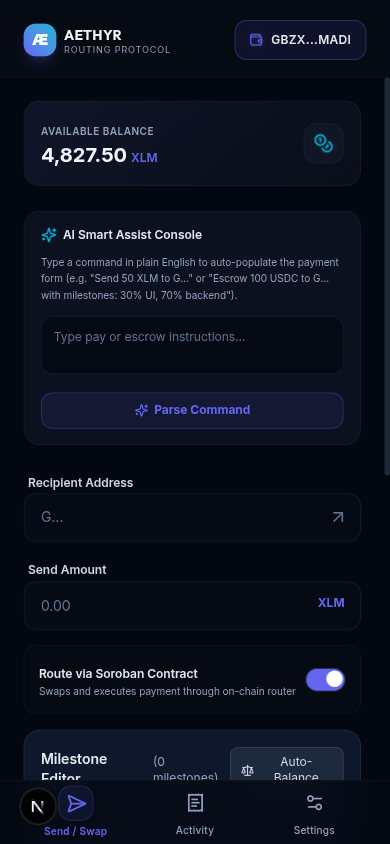
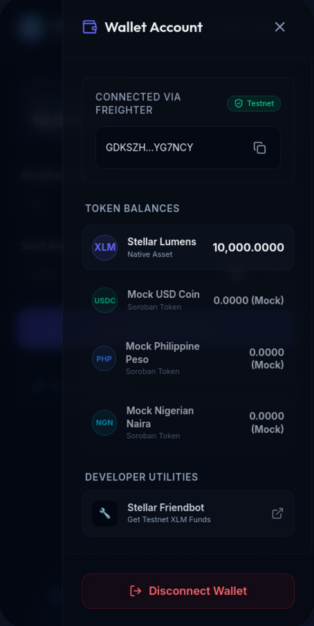
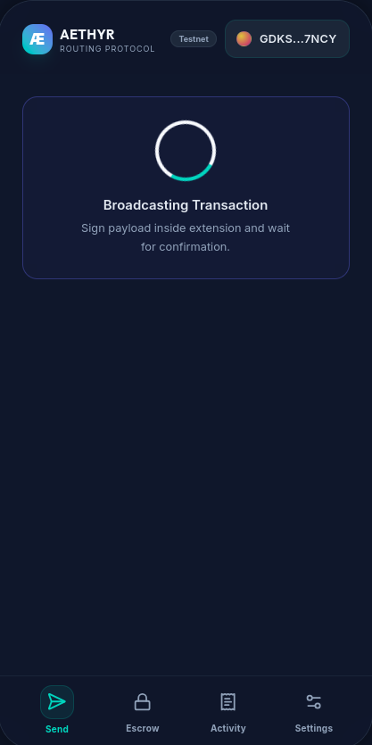
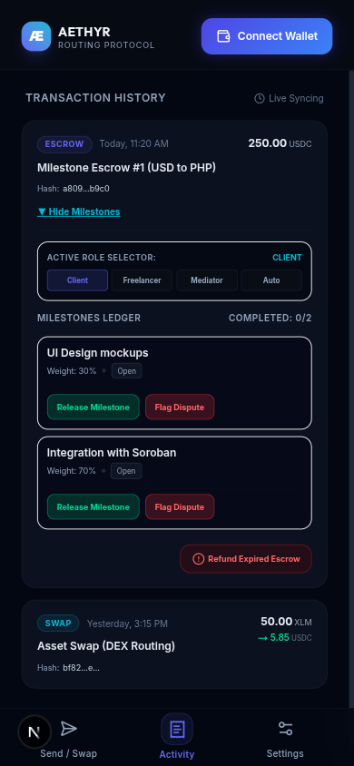
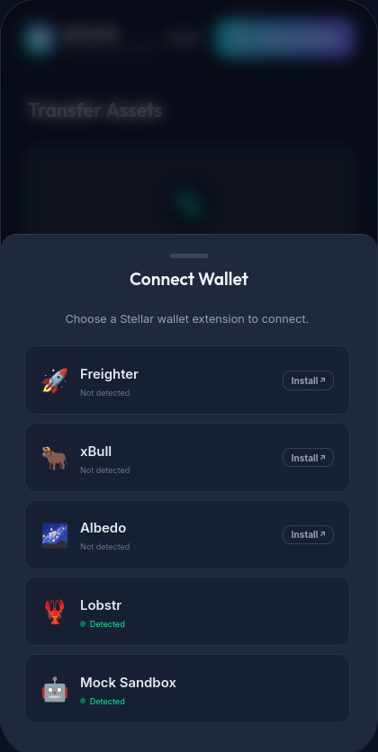
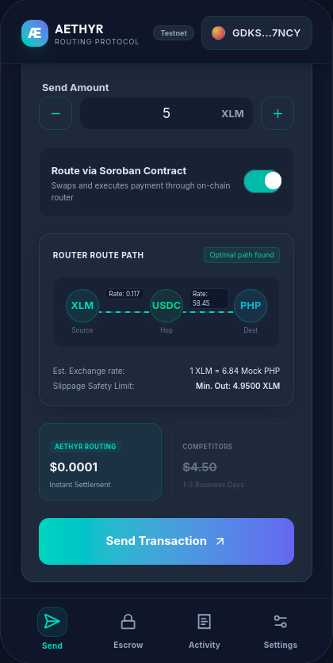
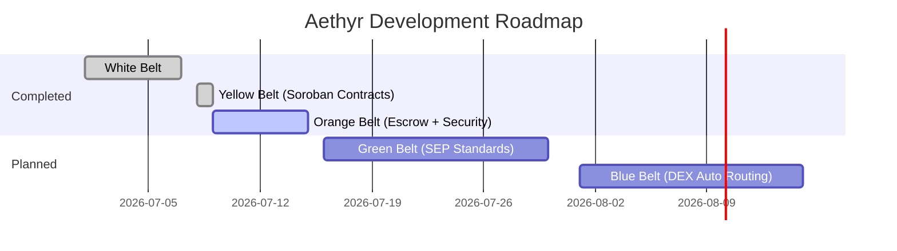

# Aethyr Hero Banner
<p align="center">
  
</p>

<h1 align="center">🌌 Aethyr</h1>
<p align="center">
  <strong>Intelligent, Intent-Based Cross-Border Payment Routing on Stellar</strong>
</p>

<p align="center">
  <a href="https://github.com/pablo-pica/aethyr/actions"></a>
  
  
  
  
  
  
</p>

---

## 💡 Value Proposition

Aethyr is an intent-based, cross-border payment router built on the Stellar network. By combining natural language artificial intelligence and decentralized exchange (DEX) liquidity, Aethyr optimizes multi-currency transaction paths in real-time to minimize fee footprints and slippage.

Traditional international remittance networks impose significant overhead through high flat fees, wide conversion spreads, and settlement delays. Aethyr addresses these issues through three main pillars:
* **AI-Driven Intent Parsing**: Users specify transactions in plain language (e.g., *"Send 50 USD equivalent in PHP to Bob for completing Milestone 1"*). Aethyr translates these inputs into structured transaction payloads.
* **DEX Pathfinding**: Aethyr calculates the most cost-effective path across Classic DEX orderbooks, automated market makers (AMMs), and Soroban liquidity pools (e.g., `PHP ➔ USDC ➔ XLM ➔ NGN`), maximizing the recipient's payout.
* **Non-Custodial Milestone Escrows**: Funds are secured inside modular Soroban milestone escrow contracts, releasing capital incrementally as milestones are completed and verified by trust anchors, with built-in dispute resolution and time-locked auto-release.

---

## 🏆 Core Achievements

### Smart Contract System (Soroban / Rust)
* 🔐 **Aethyr Router Contract** — Multi-hop DEX routing with atomic swaps and direct escrow funding.
  * **Address**: [`CDXZR77ODWNHHP5BR4BCSRS66FNHQQMUGEHGEFTX2IK4HWOAMC43ZERO`](https://stellar.expert/explorer/testnet/contract/CDXZR77ODWNHHP5BR4BCSRS66FNHQQMUGEHGEFTX2IK4HWOAMC43ZERO)
  * **Deployment Tx**: [`ed188ca...`](https://stellar.expert/explorer/testnet/tx/ed188ca785a3c129d2c450c387a094f44657ec63cad4be87e4a035a9646f4103)
* 🔐 **Aethyr Escrow Contract** — Freelancer milestone escrows with:
  * **Milestone submission** by freelancers with on-chain timestamp tracking.
  * **Client dispute** flags that block auto-release.
  * **7-day auto-release** timer for uncontested submitted milestones.
  * **30-day refund lock** to protect against dispute-bypassing refund attacks.
  * **Dust-truncation protection**: Final milestone payouts use the remaining locked balance instead of basis-point division to prevent token dust loss.
  * **11 passing Rust tests** covering happy paths, edge cases, and panic guards.

### Gasless Fee Sponsorship Relayer
* ⛽ **`/api/sponsor` Endpoint** — Server-side fee-bump transaction relayer that pays Soroban gas fees on behalf of users:
  * **Contract destination whitelisting**: Only `invokeHostFunction` calls targeting approved Aethyr contracts are sponsored (prevents fee-siphoning attacks).
  * **IP-based rate limiting**: 30 requests/minute per IP with `Retry-After` headers.
  * **Automatic client fallback**: If the relayer is unconfigured or fails, the frontend transparently falls back to user-paid fees.

### Frontend (Next.js 16 / TypeScript / Tailwind v4)
* 🦊 **Multi-Wallet Support**: StellarWalletsKit integration supporting Freighter, Albedo, and xBull via a unified modal selector.
* 🤖 **AI Intent Parser**: Gemini-powered natural language bar that converts human commands (e.g., *"Pay 100 XLM to GA... for Milestone 1"*) into structured transaction payloads.
* 📱 **PWA-Ready Layout**: Full-bleed mobile UI with safe-area notch handling, glassmorphic drawers, and a desktop phone-shell mockup.
* 🏗️ **Visual Milestone Builder**: Drag-and-edit milestone card editor for composing AI-drafted escrow milestones before on-chain submission.
* 🧪 **24 passing Vitest tests** covering AI parsing, page integration, component rendering, and API route logic.
* 🔒 **Pre-commit security hooks** scanning for Stellar private key leaks and running full test suites before every commit.

---

## 🎬 Live Demo & Presentation

* 🌐 **Live Application**: [Aethyr on Vercel](https://aethyr-pica.vercel.app/)
* 🎥 **Video Walkthrough (1-2 Min)**: [Aethyr Demo Video](https://loom.com/your-video-link)

---

## 🏗️ System Architecture

Aethyr connects users, AI models, and Stellar smart contracts into a unified payment loop:

```mermaid
graph TD
    User([User]) -->|Inputs Command / Form| UI[PWA Frontend]
    UI -->|Queries DEX Liquidity| Pathfinder[Pathfinder Engine]
    UI -->|Optional: Text Command| AI[Gemini Intent Parser]
    AI -->|Structured Params| UI
    Pathfinder -->|Best Route resolved| UI
    UI -->|Signs Tx| Wallet[StellarWalletsKit / Freighter]
    Wallet -->|Submits Signed XDR| Relayer[/api/sponsor Gasless Relayer]
    Relayer -->|Fee-Bump + Submit| RPC[Soroban Testnet RPC]
    Relayer -.->|Fallback: Direct Submit| RPC
    RPC -->|Executes| RouterContract[Aethyr Router Contract]
    RouterContract -->|Inter-Contract Call| EscrowContract[Aethyr Escrow Contract]
    RouterContract -->|Executes Swaps| DEX[Stellar DEX Pools]
    EscrowContract -->|Milestone Payout| Receiver([Recipient])
```

The client queries Horizon endpoints to identify active market makers while the Soroban smart contracts execute atomic, multi-hop swaps directly on-chain. The gasless relayer sponsors transaction fees so end-users pay zero gas costs.

---

## 📂 Code Navigation

Below is a map of the repository's directory layout to assist in codebase evaluation:

```text
aethyr/
├── .agents/                 # Developer agents instruction and status trackers
├── .github/workflows/       # CI/CD pipeline configuration
│   └── ci.yml               # GitHub Actions: lint, test (Rust + Vitest), build
├── contracts/               # Soroban smart contracts (Rust)
│   └── aethyr-router/
│       ├── contracts/
│       │   ├── aethyr-escrow/   # Milestone escrow: create, release, dispute, auto-release, refund
│       │   │   ├── src/lib.rs   # Core escrow contract logic
│       │   │   └── src/test.rs  # 7 comprehensive Rust tests
│       │   └── aethyr-router/   # DEX routing: swap, fallback, route-to-escrow
│       │       ├── src/lib.rs   # Core router contract logic
│       │       └── src/test.rs  # 4 comprehensive Rust tests
│       └── Cargo.toml           # Workspace manifest
├── docs/                    # Design documentation, architecture files, and submission assets
│   ├── assets/              # Interface screenshots and project banners
│   ├── ARCHITECTURE.md      # Core system architecture and contract specs
│   ├── BELT-REQUIREMENTS.md # JTM belt submission checklists
│   ├── PROGRESS.md          # Real-time living development progress tracker
│   └── MASTERPLAN.md        # JTM milestones timeline and strategy plan
├── scripts/
│   └── pre-commit.sh        # Git compliance hook (secret scanning + test runner)
├── src/
│   ├── app/                 # Next.js App Router pages and layouts
│   │   ├── api/sponsor/     # Gasless relayer API route
│   │   │   ├── route.ts     # Fee-bump builder with contract whitelisting + rate limiting
│   │   │   └── route.test.ts# Relayer unit tests
│   │   ├── page.tsx         # Main entry point (interactive mobile mockup container)
│   │   ├── page.test.tsx    # Page component integration tests
│   │   └── layout.tsx       # Global wrappers and metadata setup
│   ├── components/          # Reusable React components
│   │   ├── BottomNav.tsx    # Mobile-friendly PWA bottom tab navigation
│   │   ├── MilestoneBuilder.tsx # Visual milestone card editor
│   │   ├── ProfileDrawer.tsx# Wallet balance overview and account control drawer
│   │   └── WalletConnect.tsx# Interactive wallet status controller
│   ├── hooks/
│   │   ├── useFreighter.ts  # Legacy Freighter-only hook
│   │   └── useStellarWallet.ts # Full-featured hook: StellarWalletsKit, contract calls, gasless submit
│   ├── lib/
│   │   ├── aiParser.ts      # Gemini AI intent parser (natural language → tx params)
│   │   ├── aiParser.test.ts # Parser unit tests (6 cases)
│   │   ├── utils.ts         # Tailwind CSS styling and address helper functions
│   │   └── utils.test.ts    # Utility unit tests
│   └── styles/
│       └── globals.css      # Core Tailwind styling & safe-area notch utility configuration
├── package.json             # Package scripts and external dependencies
├── tsconfig.json            # TypeScript configuration
└── vitest.config.ts         # Vitest setup configuration file
```

### Key Implementation Files
* [page.tsx](./src/app/page.tsx): Primary container UI with tabs, forms, activity ledger, and milestone actions.
* [lib.rs (Escrow)](./contracts/aethyr-router/contracts/aethyr-escrow/src/lib.rs): Milestone escrow logic — create, release, submit, dispute, auto-release, refund.
* [lib.rs (Router)](./contracts/aethyr-router/contracts/aethyr-router/src/lib.rs): Payment routing contract — DEX swaps and escrow funding.
* [useStellarWallet.ts](./src/hooks/useStellarWallet.ts): Full-featured wallet hook — multi-wallet, contract calls, gasless relayer integration with exponential backoff.
* [route.ts (Sponsor)](./src/app/api/sponsor/route.ts): Gasless relayer with contract whitelisting and rate limiting.
* [aiParser.ts](./src/lib/aiParser.ts): Gemini AI intent parser converting natural language to structured payloads.
* [MilestoneBuilder.tsx](./src/components/MilestoneBuilder.tsx): Visual milestone card editor.
* [pre-commit.sh](./scripts/pre-commit.sh): Git compliance hook — secret scanning and full test runner.

---

## 🔒 Security Model

| Threat | Mitigation |
|:-------|:-----------|
| **Fee-siphoning** via arbitrary contract calls | Relayer parses XDR operations and only sponsors `invokeHostFunction` calls targeting approved Aethyr contracts |
| **Rate-drain attacks** on sponsor wallet | IP-based rate limiter (30 req/min) with `429 Retry-After` responses |
| **Dispute-bypass refund** | Refund lock extended to 30 days (`LOCK_PERIOD_SECONDS`) so disputes cannot be front-run |
| **Dust token loss** on final milestone | Final milestone pays out full remaining balance instead of basis-point calculation |
| **Private key leaks** | Pre-commit hook scans diffs for Stellar seed patterns; `SPONSOR_SECRET_KEY` is never committed |
| **Unconfigured relayer in production** | Fail-fast `503` if `SPONSOR_SECRET_KEY` is absent; random fallback key only in `test` env |

---

## 📱 Mobile App Viewports

Aethyr is designed to feel like a native mobile application. The interface scales to a true full-bleed layout on mobile devices, and displays inside a mock phone shell on desktop monitors.

| Wallet Connection | Wallet Details | Route Optimization | Transaction Receipt |
|:---:|:---:|:---:|:---:|
|  |  |  |  |

### 🟡 Yellow Belt Viewports (Multi-wallet & Smart Contract Call)

| Multi-Wallet Selector | Soroban Contract Transaction Status |
|:---:|:---:|
|  |  |

### 🟠 Orange Belt Viewports & Verification

| Mobile Viewport Layout | GitHub Actions CI/CD Pipeline | Test Suite Output |
|:---:|:---:|:---:|
|  | *[Pending: GitHub Actions CI Dashboard Screenshot]* | *[Pending: Terminal Test Suite Run Screenshot]* |

* **Verified Escrow Contract Address**: `CDXZR77ODWNHHP5BR4BCSRS66FNHQQMUGEHGEFTX2IK4HWOAMC43ZERO`
* **Advanced Contract Call Tx Hash**: `cf417f87e58e3a4cc53d4ee572115474afea0568609fbde6e49df2d8c5d14623`
* **dApp Walkthrough Demo Video**: `[Pending Walkthrough Video Link]`

---

## 🛠️ Step-by-Step Quickstart

Follow these instructions to run Aethyr locally on your development machine.

### 1. Prerequisites
Ensure you have the following installed:
* **Node.js**: v20 or later
* **npm**: v10 or later
* **Rust / Cargo**: For compiling Soroban contracts
* **Stellar CLI** (Optional, for contract invokes): `cargo install --locked stellar-cli`

### 2. Project Installation
```bash
# Clone the repository
git clone https://github.com/pablo-pica/aethyr.git
cd aethyr

# Install project dependencies
npm install
```

### 3. Environment Configuration
Duplicate the example environment file:
```bash
cp .env.example .env.local
```

Open [env.local](./.env.local) and customize its parameters:
* `NEXT_PUBLIC_STELLAR_NETWORK`: Configures the target chain network. Set to `TESTNET` for public testing.
* `NEXT_PUBLIC_STELLAR_RPC_URL`: The RPC endpoint used for Horizon queries (e.g., `https://soroban-testnet.stellar.org:443`).
* `NEXT_PUBLIC_ROUTER_CONTRACT_ID`: The deployed Soroban router contract address (`CB...`).
* `NEXT_PUBLIC_ESCROW_CONTRACT_ID`: The deployed Soroban escrow contract address (`CC...`).
* `NEXT_PUBLIC_GEMINI_API_KEY`: The API key utilized to authenticate with the Gemini API for plain text intent parsing.
* `SPONSOR_SECRET_KEY`: *(Optional)* Secret key of the fee-sponsoring account. If unset, the gasless relayer is disabled and users pay their own fees.

### 4. Running the Development Server
```bash
npm run dev
```
Open [http://localhost:3000](http://localhost:3000) inside your web browser to test.

### 5. Running Verification Suites
Verify code health by running the verification commands:
```bash
# Run frontend unit and integration tests (Vitest)
npm test

# Run smart contract tests (Rust)
cd contracts/aethyr-router && cargo test

# Run code style and structure lints (Next.js ESLint)
npm run lint
```

---

## 🗺️ Product Roadmap

Aethyr's growth roadmap charts our progress from white belt setup to high-throughput auto routing.



### ⚪ White Belt: Foundational PWA Container (Completed ✅)
* Freighter wallet connection hook integration.
* Native Testnet XLM balance queries and transfer transaction builders.
* Glassmorphic Profile Drawer side container with full responsive mockup.
* 20/20 Vitest test suite with active pre-commit security scans.

### 🟡 Yellow Belt: Soroban Contracts (Completed ✅)
* Deployed `aethyr-router` contract to Stellar Testnet:
  * **Contract Address**: [`CDXZR77ODWNHHP5BR4BCSRS66FNHQQMUGEHGEFTX2IK4HWOAMC43ZERO`](https://stellar.expert/explorer/testnet/contract/CDXZR77ODWNHHP5BR4BCSRS66FNHQQMUGEHGEFTX2IK4HWOAMC43ZERO)
  * **Deployment Tx Hash**: [`ed188ca...`](https://stellar.expert/explorer/testnet/tx/ed188ca785a3c129d2c450c387a094f44657ec63cad4be87e4a035a9646f4103)
  * **Frontend Invocation Tx Hash**: `cf417f87e58e3a4cc53d4ee572115474afea0568609fbde6e49df2d8c5d14623`
* Integrated StellarWalletsKit selector modal (Albedo, xBull, Freighter).
* Mapped contract call states (pending, success, failure) with comprehensive UI toasts.
* Error handling for 3 key transaction failures.

### 🟠 Orange Belt: Escrow & Multi-wallet Integration (In Progress 🔧)
* **Aethyr Escrow contract** with inter-contract calling (Router → Escrow).
* Freelancer milestone submission, client disputes, and 7-day auto-release timer.
* Gasless fee-bump relayer (`/api/sponsor`) with contract whitelisting and rate limiting.
* 30-day refund lock period and dust-truncation protection.
* AI-powered intent parsing bar (Gemini API).
* Visual Milestone Builder card editor.
* GitHub Actions CI/CD pipeline.
* **65 conventional commits** across dev-branch.
* **11 Rust tests + 24 Vitest tests** all passing.

### 🟢 Green Belt: SEP Standards
* Integrate **SEP-24** interactive deposit/withdrawal anchors for fiat cash-ins.
* Support **SEP-38** exchange rate quotes to compare DEX prices with anchor rates.
* Launch developer staging environments and onboard 10 testnet users.

### 🔵 Blue Belt: DEX Auto Routing Engine
* Implement localized Dijkstra/Bellman-Ford path calculations querying both Classic DEX and Soroban AMMs.
* Resolve multi-hop token paths (up to 3 hops) to maximize receiver outputs.
* Build simulation wrappers to protect users from high slippage.

---

## 📄 License
This project is licensed under the MIT License - see the [LICENSE](LICENSE) file for details.
