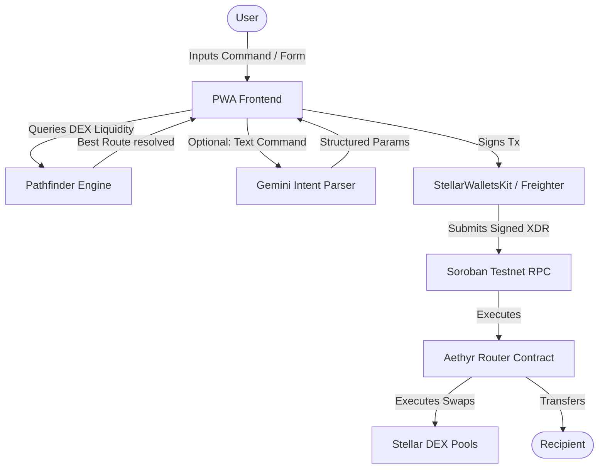

# Aethyr Hero Banner
<p align="center">
  
</p>

<h1 align="center">🌌 Aethyr</h1>
<p align="center">
  <strong>Intelligent Cross-Border Payment Routing on Stellar</strong>
</p>

<p align="center">
  
  
  
  
</p>

---

## 📝 Overview

Aethyr is an installable, mobile-first Progressive Web App (PWA) designed to route multi-currency transactions across borders with maximum efficiency and minimum fee footprint.

During this **White Belt** phase, we have established the foundational client-side infrastructure:
- 🦊 **Freighter Connection**: Complete wallet connection protocol with authorization checking.
- 🪙 **XLM Balance Monitoring**: Real-time balance retrieval of native XLM directly from the Stellar Testnet.
- 🔁 **Native XLM Transfers**: Standard transaction builder to send XLM on-chain, complete with Freighter signing and horizon broadcasting.
- 📱 **Mobile Container App Shell**: Centered mobile mockup viewport representing the native look and feel of the dApp.
- 🔄 **State Indicator & Routing Tabs**: Bottom navigation placeholders and toast/error indicators for transaction workflows.

---

## 🌐 Live Demo

- 🌐 **Live Application**: [Aethyr on Vercel](https://your-vercel-link.vercel.app)
- 🎥 **Video Walkthrough (1-2 Min)**: [Aethyr Demo Video](https://loom.com/your-video-link)

---

## 📱 Mobile App Viewports

*Note: Captured screenshots should be placed in `docs/assets/`.*

| Wallet Connection | Intent Parsing | Route Optimization | Transaction Receipt |
|:---:|:---:|:---:|:---:|
|  |  |  |  |

---

## 🏗️ System Architecture



---

## 🛠️ Tech Stack

- **Frontend**: Next.js 16 (App Router, TypeScript)
- **Styling**: Tailwind CSS v4 (Mobile Notch Safe viewport spacing)
- **Blockchain Connectivity**: `@stellar/stellar-sdk` & `@stellar/freighter-api`
- **Smart Contracts**: Soroban SDK (Rust v1.84+) *(Scheduled for Yellow Belt)*
- **CI/CD**: GitHub Actions *(Scheduled for Orange Belt)*
- **Testing**: Vitest + Soroban Unit Test Framework *(Scheduled for Orange/Yellow)*

---

## 🚀 Quick Start (Local Setup)

### 1. Prerequisites
Ensure you have Node.js (v20+) installed.

### 2. Installation & Setup
```bash
# Clone the repository
git clone https://github.com/pablo-pica/stellar-jtm.git
cd stellar-jtm

# Install dependencies
npm install

# Setup environment variables
cp .env.example .env.local
```

### 3. Run the Development Server
```bash
# Run Next.js server
npm run dev
```

---

## 📄 License
This project is licensed under the MIT License - see the [LICENSE](LICENSE) file for details.
